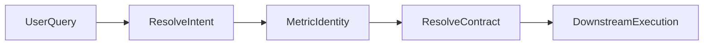

# Continuum API & SDK

Continuum (Engram Semantic Memory Core) provides:

- **Intent resolution**: map a vague question to a specific metric identity (`/metrics/resolve_intent`).
- **Typed contract resolution**: resolve a metric identity + context into a deterministic contract (`/metrics/{metric_id}/resolve`).
- **Semantic memory**: store and reuse user meaning (aliases) across turns.

## Two-step model (recommended)

1. **Resolve intent** (human-facing, may be ambiguous)
2. **Resolve contract** (machine-facing, deterministic)

